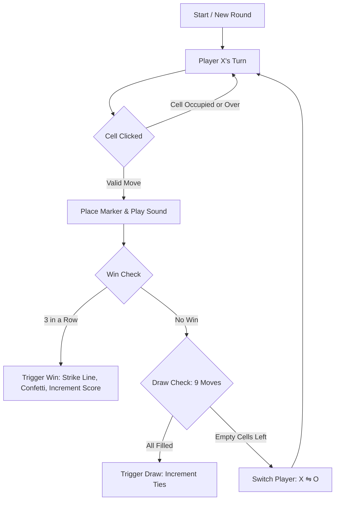

# 🎮 Modern Tic Tac Toe — 2-Player Web Game

[](https://developer.mozilla.org/en-US/docs/Web/HTML)
[](https://developer.mozilla.org/en-US/docs/Web/CSS)
[](https://developer.mozilla.org/en-US/docs/Web/JavaScript)
[](LICENSE)

A clean, responsive, and visually stunning browser-based **Tic Tac Toe** game built from scratch using semantic **HTML5**, modern **Vanilla CSS** (Glassmorphism, CSS Custom Properties, dynamic animations), and modular **Vanilla JavaScript (ES6+)**.

Developed as a submission for a **Web Development Internship Task**.

---

## 🌟 Live Demo

> 🔗 **Live URL**: [https://your-github-username.github.io/tic-tac-toe/](https://github.com)  
*(Deploy on GitHub Pages, Vercel, or Netlify with a single click)*

---

## 📸 Screenshots & Preview

| Desktop View | Mobile View |
| :---: | :---: |
| *(Interactive dark glassmorphic grid with glowing neon indicators)* | *(Fluid responsive layout tailored for touch devices)* |

```text
 ┌─────────────────────────────────────────────────────────┐
 │               ✕◯  TIC TAC TOE                           │
 │                                                         │
 │  ┌────────────────┐ ┌───────────────┐ ┌───────────────┐ │
 │  │ Player X  (1)  │ │   Ties  (0)   │ │ Player O (0)  │ │
 │  │ [Current Turn] │ │               │ │   [Waiting]   │ │
 │  └────────────────┘ └───────────────┘ └───────────────┘ │
 │                                                         │
 │          ⚡ Status: Player X's Turn to Move             │
 │                                                         │
 │                    ┌───┬───┬───┐                        │
 │                    │ ✕ │ ◯ │ ✕ │                        │
 │                    ├───┼───┼───┤                        │
 │                    │ ◯ │ ✕ │   │                        │
 │                    ├───┼───┼───┤                        │
 │                    │   │ ◯ │ ✕ │  (Win Strike!)        │
 │                    └───┴───┴───┘                        │
 │                                                         │
 │           [ 🔄 New Round ]   [ 🗑️ Reset Scores ]         │
 └─────────────────────────────────────────────────────────┘
```

---

## ✨ Features

- **🎮 Two-Player Mode (X vs O)**:
  - Alternating turn-based gameplay starting with Player X.
  - Ghost symbol preview on hover for intuitive gameplay.
- **🏆 Comprehensive Win & Draw Detection**:
  - Automatically evaluates all **8 winning lines** (3 rows, 3 columns, 2 diagonals) and full-grid ties.
  - Animated strike-through line dynamically connects the 3 winning cells.
  - Particle celebration confetti burst on victory.
- **🛡️ Strict Cell Protection**:
  - Disables overwriting occupied cells or placing marks after game completion.
- **📊 Persistent Scoreboard**:
  - Tracks Player X wins, Player O wins, and Draws (ties) across rounds.
  - Persists data across browser refreshes via `localStorage`.
- **🔊 Synthesized Audio Effects (Web Audio API)**:
  - Real-time audio generation (move clicks, victory fanfare, draw chime, button pops) with zero external audio assets.
  - Mute/Unmute sound toggle with stored user preference.
- **📱 Ultra-Responsive & Accessible**:
  - Fluid layout optimized for mobile (320px+), tablets, and 4K desktops using CSS `clamp()` and Flexbox/Grid.
  - Full keyboard support (1-9 numpad keys, Arrow keys navigation, Enter/Space, R to restart, Esc to exit modals).
  - ARIA live regions and accessibility labels for screen readers.
- **📖 Interactive Rules Guide**:
  - Built-in "How to Play" modal with instructions and shortcut guide.

---

## 🛠️ Technologies Used

| Technology | Purpose |
| :--- | :--- |
| **HTML5** | Semantic structure, ARIA accessibility attributes, modal dialogs |
| **Vanilla CSS3** | Custom design system, Glassmorphism, CSS Grid & Flexbox, micro-animations |
| **Vanilla JavaScript (ES6+)** | State management, matrix win algorithm, Web Audio API sound generator, Canvas confetti |
| **Google Fonts** | Modern typography (*Outfit* & *Plus Jakarta Sans*) |

---

## 📂 Project Structure

```text
tic-tac-toe/
├── index.html        # Main HTML document and semantic markup
├── style.css         # Design system, glassmorphism, responsive styles & animations
├── script.js         # Core game state engine, audio synthesizer & particle canvas
└── README.md         # Comprehensive project documentation
```

---

## 🚀 How to Run Locally

You do not need any package managers, build tools, or compilers! This project runs directly in any modern web browser.

### Method 1: Direct File Launch
1. Clone or download this repository:
   ```bash
   git clone https://github.com/your-username/tic-tac-toe.git
   ```
2. Navigate into the directory:
   ```bash
   cd tic-tac-toe
   ```
3. Open `index.html` in your favorite web browser (Chrome, Edge, Firefox, Safari):
   - Double-click `index.html` or drag and drop it into an open browser window.

### Method 2: Using VS Code Live Server
1. Open the project folder in **Visual Studio Code**.
2. Install the **Live Server** extension (by *Ritwick Dey*).
3. Right-click on `index.html` and select **"Open with Live Server"**.
4. The game will launch at `http://127.0.0.1:5500`.

### Method 3: Using Python Local Server
If Python is installed on your machine:
```bash
# Python 3
python -m http.server 8000
```
Then open `http://localhost:8000` in your browser.

---

## 🧠 How the Game Works (Under the Hood)

### 1. Board Representation
The 3x3 board is represented as a 1D flat array with 9 indices (`0` to `8`):
```text
 0 | 1 | 2
---+---+---
 3 | 4 | 5
---+---+---
 6 | 7 | 8
```

### 2. Win Evaluation Algorithm
At every valid move, the engine verifies the board state against the 8 pre-computed win combinations:
```javascript
const WINNING_COMBINATIONS = [
  { combo: [0, 1, 2], class: 'row-0' },     // Top Row
  { combo: [3, 4, 5], class: 'row-1' },     // Middle Row
  { combo: [6, 7, 8], class: 'row-2' },     // Bottom Row
  { combo: [0, 3, 6], class: 'col-0' },     // Left Column
  { combo: [1, 4, 7], class: 'col-1' },     // Middle Column
  { combo: [2, 5, 8], class: 'col-2' },     // Right Column
  { combo: [0, 4, 8], class: 'diag-main' }, // Top-Left to Bottom-Right
  { combo: [2, 4, 6], class: 'diag-anti' }  // Top-Right to Bottom-Left
];
```

### 3. Turn Transition & State Flow


---

## ⌨️ Keyboard Shortcuts

| Key | Action |
| :--- | :--- |
| `1` – `9` / Numpad | Mark corresponding cell from top-left (1) to bottom-right (9) |
| `Arrow Keys` | Navigate between board cells |
| `Space` / `Enter` | Select currently focused cell |
| `R` / `r` | Start a **New Round** |
| `Esc` | Close **How to Play** dialog |

---

## 🧪 Verified Test Cases

The application has been thoroughly tested across all edge conditions:
- ✅ **Player X Victory**: All 3 rows, 3 columns, and 2 diagonals tested.
- ✅ **Player O Victory**: Turn switching verified; win declared accurately for Player O.
- ✅ **Stalemate (Draw)**: Full 9-move game without 3-in-a-row properly triggers draw UI.
- ✅ **Duplicate Click Prevention**: Clicking occupied cells triggers no action and doesn't switch turns.
- ✅ **Round & Score Reset**: "New Round" resets grid only; "Reset Scores" resets scoreboard with confirmation.
- ✅ **Cross-Browser & Responsive**: Verified on Chrome, Edge, Safari, Firefox, and mobile viewport sizes.

---

## 📄 License

This project is licensed under the **MIT License** — feel free to use it for learning, portfolios, or enhancements.
